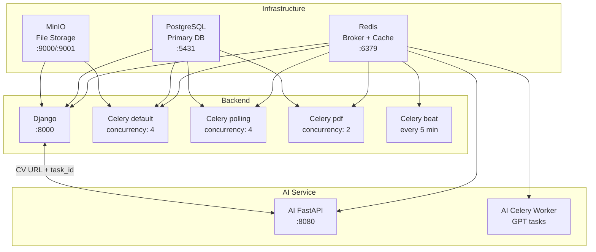
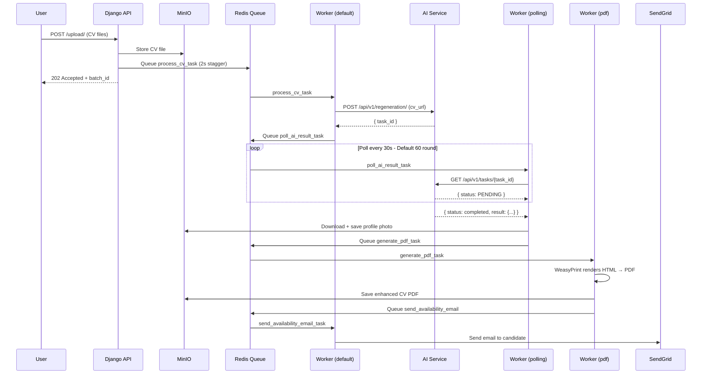
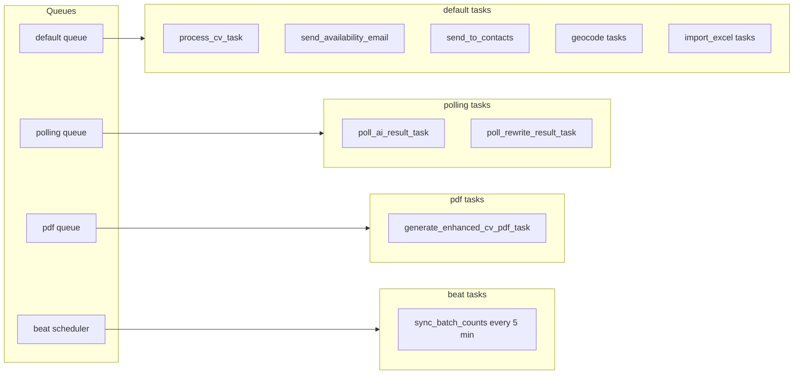
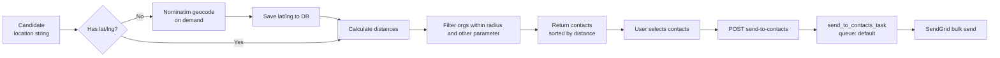

# EduKai CV Automation Engine 🚀📄

A production-grade backend system that automates the full lifecycle of candidate CV processing for an education recruitment agency — from bulk upload through AI-powered enhancement, PDF generation, geo-filtered organization matching, and targeted email outreach.

Built with **Django 6**, **Celery**, **MinIO**, **PostgreSQL**, **Redis**, and **SendGrid**, containerised with **Docker**. 🐳


---

## Table of Contents 📚

- [Overview](#overview)
- [Architecture](#architecture)
- [Tech Stack](#tech-stack)
- [Project Structure](#project-structure)
- [Getting Started — Docker](#getting-started--docker)
- [Getting Started — Local Development](#getting-started--local-development)
- [Environment Variables](#environment-variables)
- [API Reference](#api-reference)
- [Background Tasks](#background-tasks)
- [Performance Notes](#performance-notes)
- [Key Design Decisions](#key-design-decisions)

---

## Overview 🎯

EduKai automates a recruitment agency's entire candidate workflow:

1. **Bulk CV Upload** — Upload 500–1000 CVs at once. Each CV is stored in MinIO and queued for AI processing.
2. **AI Processing** — A FastAPI AI service extracts candidate data, performs quality checks, and generates enhanced email content using Celery.
3. **PDF Generation** — WeasyPrint generates a branded enhanced CV PDF stored in MinIO.
4. **Availability Email** — Candidates are automatically emailed about new opportunities via SendGrid. ✉️
5. **Organization Management** — Import 24,000+ schools from Excel, auto-geocode addresses using Nominatim (free, no API key).
6. **Geo Filtering** — Find all organizations within N km of a candidate using their postcode. 📍
7. **Targeted Outreach** — Send candidate profiles to up to 1000 selected school contacts in one request.
8. **Dashboard** — Real-time statistics, activity log, and notification system for the system operator. 📊

---

## Architecture 🏗️

### Docker services 🐋



### CV processing flow 🔄



### Celery queue architecture 📬



### System flow — organization geo matching 🗺️



---

## Tech Stack 🛠️

| Layer | Technology |
|---|---|
| Web Framework | Django 6.0.2 + Django REST Framework |
| AI Service | FastAPI + Celery (separate service) |
| Task Queue | Celery 5.6 with Redis broker |
| Database | PostgreSQL 16 |
| Cache / Broker | Redis 7 |
| File Storage | MinIO (S3-compatible) |
| PDF Generation | WeasyPrint |
| Email | SendGrid |
| Geocoding | Nominatim / OpenStreetMap (free, no API key) |
| Auth | JWT via djangorestframework-simplejwt (HttpOnly cookies) |
| API Docs | drf-spectacular (Swagger + ReDoc) |
| Containerisation | Docker + Docker Compose |

---

## Project Structure 🗂️

```
EduKai-CV-Automation-Engine/
├── docker-compose.yml              # Orchestrates all 9 services
│
├── Backend/                        # Django backend (primary focus)
│   ├── Dockerfile
│   ├── requirements.txt
│   ├── manage.py
│   ├── .env.example                # Copy to .env and configure
│   ├── Create_the_MinIO_Bucket.py  # One-time MinIO bucket setup
│   │
│   ├── edukai/                     # Django project config
│   │   ├── settings.py
│   │   ├── celery.py               # Celery app + task routing
│   │   └── urls.py
│   │
│   ├── account/                    # Auth, users, dashboard, activity log
│   │   ├── models.py               # User + ActivityLog models
│   │   ├── views.py                # Auth, dashboard, activity endpoints
│   │   ├── serializers.py
│   │   └── utils/
│   │       ├── activity.py         # log_activity() helper
│   │       ├── cookies.py          # HttpOnly JWT cookie helpers
│   │       └── password_reset.py   # OTP via Redis + SendGrid
│   │
│   ├── candidate/                  # Core candidate management
│   │   ├── models.py               # Candidate, CandidateUploadBatch
│   │   ├── views.py                # 15+ API endpoints
│   │   ├── serializers.py
│   │   ├── tasks/
│   │   │   ├── process_cv.py       # Task 1: submit CV to AI
│   │   │   ├── poll_ai_result.py   # Task 2: poll AI, save data, download photo
│   │   │   ├── generate_pdf.py     # Task 3: WeasyPrint PDF generation
│   │   │   ├── rewrite_cv.py       # AI rewrite polling task
│   │   │   ├── send_email.py       # Candidate availability email
│   │   │   ├── send_to_contacts.py # Bulk outreach to school contacts
│   │   │   ├── geocode.py          # On-demand candidate geocoding
│   │   │   ├── sync_batch.py       # Periodic batch progress sync
│   │   │   └── cleanup.py          # MinIO file cleanup on delete
│   │   ├── utils/
│   │   │   ├── minio_utils.py      # Pre-signed URL generation
│   │   │   └── pagination.py       # StandardPagination class
│   │   └── templates/
│   │       └── candidate/
│   │           └── enhanced_cv.html # WeasyPrint CV template
│   │
│   ├── organization/               # School/organization management
│   │   ├── models.py               # Organization + OrganizationContact
│   │   ├── views.py                # CRUD + import + geo filter endpoints
│   │   ├── serializers.py
│   │   └── tasks/
│   │       ├── geocode.py          # Postcode to lat/lng via Nominatim
│   │       └── import_excel.py     # Bulk Excel import (24,000+ orgs)
│   │
│   └── Demo Data/
│       ├── Organizations.xlsx      # Sample organization data
│       ├── Contacts.xlsx           # Sample contact data
│       └── Demo CV/                # Sample CV PDFs for testing
│
└── AI/                             # FastAPI AI service (separate service)
    ├── app/
    │   ├── main.py                 # FastAPI app entry point
    │   ├── tasks.py                # Celery tasks (CV processing)
    │   ├── api/v1/routes.py        # /regeneration, /rewrite, /tasks endpoints
    │   ├── services/
    │   │   ├── ai_service.py       # OpenAI GPT integration
    │   │   └── file_service.py     # CV download and parsing
    │   └── prompts/                # GPT prompt templates
    └── requirements.txt
```

---

## Getting Started — Docker 🧭

### Prerequisites ✅

- [Docker Desktop](https://www.docker.com/products/docker-desktop/) installed and running
- Git

### Steps

**1. Clone the repository**

```bash
git clone https://github.com/Mehedi-Hasan-Rabbi/EduKai-CV-Automation-Engine
cd EduKai-CV-Automation-Engine
```

**2. Configure environment variables** 🔐

```bash
cp Backend/.env.example Backend/.env
cp AI/.env.example AI/.env
```

Open `Backend/.env` and set at minimum:

```env
SECRET_KEY=your-50-char-secret-key-here
SENDGRID_API_KEY=SG....
SENDGRID_FROM_EMAIL=you@yourdomain.com
```

Open `AI/.env` and add:

```env
OPENAI_API_KEY=sk-...
```

**3. Build and start all services** 🚢

```bash
docker compose up --build
```

This starts 9 containers. Wait until you see all workers report `ready`.

**4. Create a superuser**

In a new terminal:

```bash
docker compose exec backend python manage.py createsuperuser
```

**5. Create the MinIO bucket** 🪣

Option A — via script (recommended):
```bash
cd Backend
docker compose exec backend python Create_the_MinIO_Bucket.py
```

Option B — via browser:
1. Open [http://localhost:9001](http://localhost:9001)
2. Login: `minioadmin` / `minioadmin123`
3. Create a bucket named `edukai`
4. Set the bucket access policy to **Public**

**6. Verify everything is running** ✅

| Service | URL |
|---|---|
| Django API | http://localhost:8000 |
| Swagger Docs | http://localhost:8000/api/docs/ |
| ReDoc | http://localhost:8000/api/redoc/ |
| Django Admin | http://localhost:8000/admin/ |
| AI Service | http://localhost:8080 |
| MinIO Console | http://localhost:9001 |

**7. Import demo data (optional)** 📥

```
POST http://localhost:8000/api/organizations/import/
Body: form-data → file: Backend/Demo Data/Organizations.xlsx

POST http://localhost:8000/api/organizations/import/contacts/
Body: form-data → file: Backend/Demo Data/Contacts.xlsx
```

---

## Getting Started — Local Development 🖥️

Running without Docker requires starting each service manually. You need PostgreSQL, Redis, and MinIO running locally first.

### Step 1 — Start infrastructure with Docker (individual containers)

```bash
# Redis
docker run --name edukai-redis -d -p 6379:6379 --rm redis

# MinIO
docker run -d -p 9000:9000 -p 9001:9001 \
  --name edukai-minio \
  -e MINIO_ROOT_USER=minioadmin \
  -e MINIO_ROOT_PASSWORD=minioadmin123 \
  -v minio_data:/data \
  minio/minio server data --console-address ":9001"

# PostgreSQL
docker run --name edukai-postgres \
  -e POSTGRES_PASSWORD=ultr4_instinct \
  -p 5431:5432 \
  -d postgres
```

### Step 2 — Set up and run the AI service 🤖

```bash
cd AI

# Create and activate virtual environment
python -m venv venv
source venv/bin/activate       # Windows: venv\Scripts\activate

# Install dependencies
pip install -r requirements.txt

# Copy and configure env
cp .env.example .env
# Add OPENAI_API_KEY to .env
```

Open two terminals in the `AI/` directory:

```bash
# Terminal 1 — AI FastAPI server
uvicorn app.main:app --reload --port 8080

# Terminal 2 — AI Celery worker
celery -A app.core.celery_app worker --loglevel=info
```

### Step 3 — Set up and run the Django backend 🐍

```bash
cd Backend

# Create and activate virtual environment
python -m venv venv
source venv/bin/activate       # Windows: venv\Scripts\activate

# Install dependencies
pip install -r requirements.txt

# Copy and configure env
cp .env.example .env
# Set DATABASE_URL, REDIS_URL, MINIO_*, AI_BASE_URL, etc.

# Run migrations and create superuser
python manage.py migrate
python manage.py createsuperuser
```

### Step 4 — Start backend workers (4 separate terminals) ⚙️

```bash
# Terminal 1 — Django development server
python manage.py runserver

# Terminal 2 — Default worker (CV processing, geocoding, emails, imports)
celery -A edukai worker \
  --queues=default \
  --concurrency=4 \
  --loglevel=info \
  --hostname=default@%h

# Terminal 3 — PDF worker (WeasyPrint, memory-intensive)
celery -A edukai worker \
  --queues=pdf \
  --concurrency=2 \
  --loglevel=info \
  --hostname=pdf@%h

# Terminal 4 — Polling worker (AI result polling)
celery -A edukai worker \
  --queues=polling \
  --concurrency=4 \
  --loglevel=info \
  --hostname=polling@%h

# Terminal 5 — Beat scheduler (periodic tasks every 5 min)
celery -A edukai beat --loglevel=info
```

### Step 5 — Create MinIO bucket 🪣

```bash
python Create_the_MinIO_Bucket.py
```

Or open [http://localhost:9001](http://localhost:9001), login with `minioadmin/minioadmin123`, create bucket `edukai`, set access to Public.

---

## Environment Variables 🔧

### Backend (`Backend/.env`)

| Variable | Required | Description |
|---|---|---|
| `SECRET_KEY` | ✅ | Django secret key (min 50 chars) |
| `DEBUG` | ✅ | `True` for dev, `False` for production |
| `DATABASE_URL` | ✅ | PostgreSQL connection string |
| `REDIS_URL` | ✅ | Redis URL for Django cache (e.g Use DB 1) |
| `CELERY_BROKER_URL` | ✅ | Redis URL for Celery broker (e.g Use DB 2) |
| `CELERY_RESULT_BACKEND` | ✅ | Redis URL for Celery results (e.g Use DB 2) |
| `USE_S3` | ✅ | `True` to use MinIO/S3 storage |
| `MINIO_ACCESS_KEY` | ✅ | MinIO access key |
| `MINIO_SECRET_KEY` | ✅ | MinIO secret key |
| `MINIO_BUCKET_NAME` | ✅ | MinIO bucket name |
| `MINIO_ENDPOINT_URL` | ✅ | Internal MinIO URL (backend to MinIO) |
| `MINIO_PUBLIC_URL` | ✅ | Public MinIO URL (browser to MinIO) |
| `AI_BASE_URL` | ✅ | AI service base URL |
| `AI_POLL_INTERVAL_SECONDS` | — | Polling interval in seconds (default: 30) |
| `AI_POLL_MAX_RETRIES` | — | Max poll attempts (default: 60 = 30 min) |
| `SENDGRID_API_KEY` | — | SendGrid API key |
| `SENDGRID_FROM_EMAIL` | — | Verified sender email address |
| `SENDGRID_FROM_NAME` | — | Display name for outgoing emails |
| `SENDGRID_REPLY_TO_EMAIL` | — | Reply-to email address |
| `CV_LOGO_PATH` | — | Path to logo image used in CV PDF |

### AI Service (`AI/.env`)

| Variable | Required | Description |
|---|---|---|
| `OPENAI_API_KEY` | ✅ | OpenAI API key |
| `REDIS_URL` | ✅ | Redis URL (uses separate DB from backend. e.g. Use DB 3) |
| `APP_BASE_URL` | ✅ | AI service's own base URL |

---

## API Reference 📡

Full interactive documentation at [http://localhost:8000/api/docs/](http://localhost:8000/api/docs/).

### Authentication — `/api/auth/`

| Method | Endpoint | Auth | Description |
|---|---|---|---|
| POST | `/register/` | Public | Create account |
| POST | `/login/` | Public | Login, sets HttpOnly JWT cookies |
| POST | `/logout/` | Required | Logout, clears cookies |
| POST | `/token/refresh/` | Public | Refresh access token from cookie |
| GET | `/me/` | Required | Current user profile |
| PATCH | `/profile/update/` | Required | Update profile photo, name, etc. |
| POST | `/password/update/` | Required | Change password |
| POST | `/forgot-password/` | Public | Request password reset OTP via email |
| POST | `/verify-otp/` | Public | Verify OTP code |
| POST | `/reset-password/` | Public | Set new password |
| GET | `/dashboard/` | Superuser | System-wide statistics |
| GET | `/activity/` | Superuser | Activity log and notifications |
| POST | `/activity/mark-read/` | Superuser | Mark notifications as read |

### Candidates — `/api/candidates/`

| Method | Endpoint | Description |
|---|---|---|
| POST | `/upload/` | Bulk CV upload (multipart, up to 1000 files) |
| GET | `/` | Paginated candidate list with filters |
| GET | `/<id>/` | Full candidate detail |
| PATCH | `/<id>/update/` | Edit candidate fields, triggers PDF regen if needed |
| DELETE | `/<id>/delete/` | Delete candidate and MinIO files (async) |
| POST | `/<id>/rewrite/` | Trigger AI CV rewrite |
| GET | `/<id>/rewrite/status/` | Poll rewrite completion |
| GET | `/<id>/nearby-organizations/` | Organizations within radius of candidate |
| GET | `/<id>/nearby-contacts/` | School contacts within radius (filterable) |
| POST | `/<id>/send-to-contacts/` | Email candidate profile to up to 1000 contacts |
| GET | `/send-status/<task_id>/` | Poll email send task result |
| GET | `/batches/` | Paginated list of upload batches |
| GET | `/batches/<id>/` | Batch progress and status |
| DELETE | `/batches/<id>/delete/` | Delete batch and all candidates |

### Organizations — `/api/organizations/`

| Method | Endpoint | Description |
|---|---|---|
| GET | `/` | Paginated list with filters (phase, town, postcode, geo radius) |
| POST | `/` | Create organization (auto-geocodes postcode) |
| GET | `/<id>/` | Organization detail with nested contacts |
| PATCH | `/<id>/` | Update organization (re-geocodes if address changes) |
| DELETE | `/<id>/` | Delete organization and all contacts |
| POST | `/import/` | Bulk import from Excel file (background task) |
| POST | `/import/contacts/` | Bulk contact import from Excel |
| GET | `/import/status/<task_id>/` | Poll import task result |
| GET | `/contacts/` | All contacts across all organizations |
| GET | `/<id>/contacts/` | Contacts for a specific organization |
| POST | `/<id>/contacts/` | Add contact to organization |
| GET | `/contacts/<id>/` | Contact detail |
| PATCH | `/contacts/<id>/` | Update contact |
| DELETE | `/contacts/<id>/` | Delete contact |

---

## Background Tasks ⏱️

Four dedicated Celery queues prevent task interference under heavy load:

| Queue | Container | Tasks | Concurrency |
|---|---|---|---|
| `default` | `celery_default` | CV processing, geocoding, emails, Excel import | 4 |
| `polling` | `celery_polling` | AI result polling, rewrite polling | 4 |
| `pdf` | `celery_pdf` | PDF generation (memory-intensive) | 2 |
| `beat` | `celery_beat` | Periodic tasks (batch sync every 5 min) | — |

### Task chain — full CV lifecycle 🔗

```
[Upload] BulkCVUploadView
    └─ process_cv_task (default)
           POST cv_url to AI → get task_id
           └─ poll_ai_result_task (polling)
                  polls every 30s → extracts data → downloads profile photo
                  └─ generate_enhanced_cv_pdf_task (pdf)
                         WeasyPrint → PDF → MinIO
                         └─ send_availability_email_task (default)
                                SendGrid → candidate inbox
```

### Periodic tasks 🕒

`sync_batch_counts` runs every 5 minutes via Celery Beat. It recalculates batch `processed_count` and `failed_count` from actual candidate statuses — fixing batches stuck at 0% when workers crash mid-task.

---

## Performance Notes 📈

These are real-world observations from production testing.

**CV processing time** — A batch of 600 CVs took approximately 1.5 hours end-to-end. This includes AI extraction (the bottleneck), PDF generation, and email sending. Processing time scales linearly with batch size.

**Geocoding time** — Nominatim (free OpenStreetMap geocoder) enforces a 1 request/second rate limit. For safety, a 2-second stagger is used between geocoding tasks. Calculation: `number_of_organizations × 2 seconds`. For 500 organizations, expect ~17 minutes. For 24,000 organizations, geocoding runs as a background process over many hours. The application remains fully functional during geocoding — only the geo-radius filter is unavailable for organizations not yet geocoded.

**Sendgrid email deliverability** — New SendGrid accounts have low sender reputation. Emails may initially go to spam. This improves over time as the domain builds reputation. To improve deliverability: verify your sending domain DNS records in SendGrid, enable IP warmup for new accounts, use a personal sender name rather than a brand name, and avoid emojis in subject lines. 📨

**Bulk email sending** — Sending to 1000 contacts is handled by a single Celery task that iterates sequentially. SendGrid processes each email individually. Expect roughly 2-5 minutes for 1000 emails depending on network latency.

---

## Key Design Decisions 🧠

**Separate Celery queues** — PDF generation is slow and memory-heavy. Mixing it with polling tasks in one queue would cause AI polling to timeout. Each queue has appropriate concurrency for its workload.

**Two MinIO clients** — Pre-signed URLs must be signed with the public URL (what the browser sees). File operations use the internal container URL for speed. `minio_utils.py` maintains two separate boto3 clients to handle this correctly and avoid `SignatureDoesNotMatch` errors.

**On-demand geocoding for candidates** — Geocoding 1000+ candidates on upload would take 20+ minutes and block the upload response. Coordinates are populated only when a geo filter is first requested, then cached permanently on the candidate record for instant subsequent lookups.

**`is_regeneration` flag on PDF generation** — When a user edits `job_titles`, `name`, or `location`, the PDF is automatically regenerated. The flag skips incrementing `batch.processed_count` and sending the availability email again on regeneration, preventing double-counting and duplicate emails.

**Short PostgreSQL `conn_max_age`** — Under heavy concurrent load (300+ CVs), long-lived DB connections are killed by PostgreSQL, causing `SSL connection closed unexpectedly` errors in workers. Set to 60 seconds to force fresh reconnections instead of reusing stale ones.

**ActivityLog 1000-entry limit** — The system is operated by a single user. Rather than a complex WebSocket or pub/sub notification infrastructure, a simple DB-backed activity log with automatic pruning at 1000 entries covers all needs efficiently.

**JWT in HttpOnly cookies** — Access and refresh tokens are stored in HttpOnly cookies, not localStorage. This prevents XSS attacks from stealing tokens. The custom `CookieJWTAuthentication` class falls back to the `Authorization` header for Swagger UI compatibility.

**Batch task staggering** — When uploading 250 CVs, tasks fire with a 2-second countdown per CV (`countdown=index * 2`). This prevents the AI service from being overwhelmed with simultaneous requests and reduces the chance of 429 rate limit errors.

---

## Postman Collection 📮

`Backend/Backend.postman_collection.json` contains all endpoints pre-configured for local testing. Import it into Postman and set `base_url` to `http://localhost:8000`.

---

## License 📝

MIT License — see [LICENSE](LICENSE) for details.